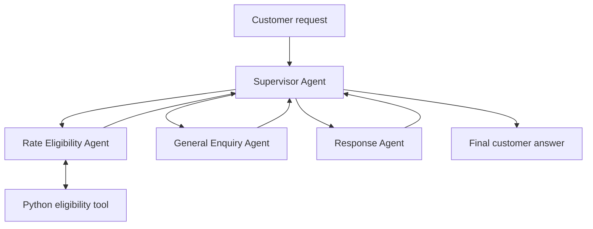

# Shipping agent governance POC

Four native watsonx Orchestrate agents handle shipping enquiries without RAG.
A read-only Python tool evaluates synthetic rate eligibility inside the
Orchestrate tools runtime. Two deterministic fault cases provide repeatable
evidence for watsonx.governance evaluation.

## Architecture



In native Orchestrate, collaborators return to the primary agent. The Supervisor
selects one specialist, sends its complete result and the original request to
Response Agent, then relays `customer_answer` unchanged.

| Agent | Responsibility | Tool / knowledge |
| --- | --- | --- |
| [Supervisor](agents/supervisor_agent.yaml) | Select one specialist, coordinate review, return final text. | No tools or KBs |
| [Rate Eligibility](agents/rate_eligibility_agent.yaml) | Extract inputs and invoke eligibility. | `evaluate_rate_eligibility` |
| [General Enquiry](agents/general_enquiry_agent.yaml) | Answer non-rate questions from model reasoning. | No tools or grounding |
| [Response](agents/response_agent.yaml) | Check routing, completeness, consistency, and policy claims. | No tools or KBs |

Agent handoffs are instruction-based rather than a typed workflow. Runtime traces
and evaluations must confirm actual behavior.

## Python eligibility tool

[rate_eligibility.py](tools/rate_eligibility.py) is imported directly into the
Orchestrate Python tools runtime. It needs no FastAPI server, public URL, tunnel,
or application connection.

Approved baseline rules:

| Destination mix | Monthly volume | Tier | Discount |
| --- | --- | --- | --- |
| international_heavy | 1,000 or more | Platinum | 18% |
| international_heavy | 500–999 | Gold | 12% |
| mixed | 500 or more | Gold | 10% |
| mixed | 100–499 | Silver | 6% |
| domestic_only | 1 or more | Bronze | 3% |
| Any valid mix | 0, or no matching threshold | Standard | 0% |

The tool validates all inputs and returns a simulated tier, fraction and percent,
input echo, matched rule, policy version, deterministic decision ID, and explicit
limitations. Business type is audit metadata in the approved baseline.

## Controlled governance faults

The tool deliberately contains two exact, repeatable test cases:

| Inputs | Deliberate behavior | Expected control |
| --- | --- | --- |
| 777/month, mixed, retail | Returns Platinum/25% instead of Gold/10% | Ground-truth correctness evaluation must breach |
| 13/month, domestic_only, other | Adds a binding, permanent guarantee claim | Response review must block the claim; policy evaluation records tool violation |

All other valid inputs follow the approved baseline. The triggers are deterministic
so repeated evaluation runs measure the same behavior. Details and expected
evidence are in [the fault-injection guide](governance/fault-injection.md).

## Validate locally

Use Python 3.12:

```bash
make env
make test
```

The test suite validates the four ADK agent schemas, Python tool schema and import
metadata, approved thresholds, invalid inputs, controlled faults, renderer, and
deployment ordering. It does not execute an LLM or prove tenant routing quality.

## Import and test drafts

Configure `.env`:

- `WO_INSTANCE_URL`, `WO_API_KEY`, `WO_ENV_NAME`, and `WO_ENV_TYPE`; CPD also
  requires `WO_USERNAME`
- `WO_AGENT_MODEL`, using a full ID returned by `make models`

Then run:

```bash
make models
make render
make import
```

Import order: Python tool → Rate Eligibility → General Enquiry → Response →
Supervisor. Open the Supervisor draft preview and run
[the chat cases](docs/smoke-tests.md), including both governance probes.

After draft tests pass:

```bash
make deploy
make list
```

No remote import or deployment is performed automatically by this repository.

For moving this project to a tenant-connected machine, finding the correct
credentials, and publishing in dependency order, follow the
[remote machine deployment runbook](docs/remote-machine-deployment.md).

### Developer Edition

With Developer Edition running and a model configured:

```bash
make models-local
make import-local
.venv/bin/orchestrate chat start
```

Developer Edition supports draft testing; this helper rejects live local deploy.

## Governance and native interfaces

Monitoring is tenant state, not an agent YAML field. After import, enable it for
each of the four agent IDs and verify every GET response returns
`"monitoring_enabled": true`. Then associate all four agents with the Governance
use case, synchronize metrics, configure thresholds, and use native Orchestrate
Chat plus the Governance Console dashboard.

Follow the complete [deployment and Governance runbook](docs/deploy-governance-native-ui.md).

## Next tool suggestion

`check_shipping_serviceability` could accept origin country, destination country,
and shipment type, then return serviceability, supported services, restrictions,
and a rule ID. It is proposed but not implemented.

## Project layout

```text
agents/                    Four native agent YAML templates
tools/                     Active Python eligibility tool and runtime requirements
scripts/                   Validation, rendering, import, and deployment helpers
tests/                     Offline tool and asset tests
docs/                      Contracts, chat cases, limitations, and evidence
governance/                Monitoring runbook and controlled fault definitions
archive/openapi-api/       Previous FastAPI/OpenAPI implementation
archive/rag-poc/           Previous RAG implementation
```

Only `${WO_AGENT_MODEL}` is rendered into the active agent templates. Credentials
are read as dotenv data and never written into agent YAML.

## References

- [Deploy, enable monitoring, integrate Governance, and use native UIs](docs/deploy-governance-native-ui.md)
- [Agent handoff contracts](docs/agent-contracts.md)
- [Validation evidence](docs/evidence/shipping/validation.md)
- [Verified CLI/schema details](docs/cli-surface.md)
- [Open questions and limitations](docs/open-questions.md)
- [IBM Python tools](https://developer.watson-orchestrate.ibm.com/tools/create_tool)
- [IBM native agents](https://developer.watson-orchestrate.ibm.com/agents/build_agent)
