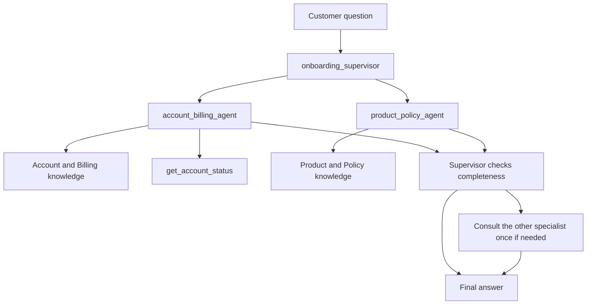

# watsonx Orchestrate governance POC

Three native agents for a small customer-onboarding governance demonstration.
The current increment includes three agents, two knowledge bases backed by
12 Markdown documents, and a deterministic account-status tool. Environment
credentials and the tenant model ID remain configurable placeholders.

## Agents



| Agent | Responsibility |
| --- | --- |
| `onboarding_supervisor` | Choose the first specialist, check completeness, and compose an answer. |
| `account_billing_agent` | Account setup/status, invoices, payments, and billing. |
| `product_policy_agent` | Features, onboarding requirements, eligibility, SLAs, and terms. |

The knowledge describes a fictional service, **Northstar Workspace**. It covers
account setup, billing, payments, invoices, plan limits, eligibility, SLAs, and
terms. The tool returns four synthetic account snapshots. The supervisor owns
routing, completeness checking, and final composition.

Supported questions should now receive grounded answers. Missing information
still requires an explicit unavailable response. One deliberate refund-policy
conflict tests whether the agent reports contradictory evidence. See the
[knowledge index](knowledge/README.md) and [tool contract](tools/README.md).

All agents use `react_core`. The model is supplied through `WO_AGENT_MODEL`.
Routing limits are instructions to the model and must be checked in runtime
traces; YAML validation does not prove routing behavior.

## Get started

Use Python 3.12. The ADK is pinned to **2.16.1**. A project `.venv` has been
prepared in this workspace. On a fresh checkout:

```bash
make setup
```

Create the local placeholder configuration and check the agents without a tenant:

```bash
make env
make test
make knowledge
```

`make env` preserves an existing `.env`. `.env`, `.venv`, and `.build` are ignored
by Git. Shell environment values override values in `.env`.

### Import drafts into the existing SaaS tenant

1. Fill `WO_INSTANCE_URL` and `WO_API_KEY` in `.env` from Orchestrate **Settings >
   API details**. Check `WO_ENV_NAME` and `WO_ENV_TYPE` (`ibm_iam` for IBM Cloud).
2. List the models available to the tenant:

   ```bash
   make models
   ```

3. Set `WO_AGENT_MODEL` to a full provider/model ID from that list. Select a
   chat model that supports native function calling and `react_core`.
4. Render and import:

   ```bash
   make render
   make import
   ```

The import command registers or reuses the named environment, activates it, then
imports both KBs, verifies index readiness and the expected document names,
imports the account tool, and imports both specialists followed by the supervisor.
It updates resources with the same names. KB updates replace the corpus with the
listed documents, so reserve these KB names for the POC. It stops on CLI failure
or incomplete/stale knowledge ingestion.
Use a POC environment/workspace where these names are appropriate.

`agents/*.yaml` are source templates. **Do not import them directly:** the ADK
does not substitute `${WO_AGENT_MODEL}`. `make render` writes ordinary,
ADK-validated YAML to `.build/agents/`. Only the model ID is substituted;
credentials are never copied into agent YAML.

Knowledge sources stay in `knowledge/docs/**/*.md`. `make knowledge` (or
`make render`) creates supported `.txt` upload copies and rendered KB YAML in
`.build/knowledge/`. The copies retain the source bytes exactly. The source KB
YAML contains Markdown paths and should also be imported through this renderer.

The ADK can poll ingestion for up to 20 minutes per KB. If import stops at the
readiness check, inspect `orchestrate knowledge-bases status --name NAME --verbose`
and run `make knowledge-status` after ingestion completes, then retry the import.

Open **Manage agents**, select `onboarding_supervisor`, and use the draft preview
to run [the smoke checks](docs/smoke-tests.md). `make list` lists native agents.

### Deploy live on SaaS

When ready to publish the current YAML:

```bash
make deploy
```

This re-imports the current KBs, tool, and agents, then deploys both collaborators followed
by the supervisor. Deployment makes the agents live. It is separate from draft
import. A failure can leave earlier imports/deployments completed; fix the cause
and rerun. The script does not perform automatic rollback.

### Optional Developer Edition

Docker and the Developer Edition prerequisites are needed only for this path.
Fill the entitlement settings in `.env` using your IBM subscription details,
then run:

```bash
source .venv/bin/activate
orchestrate server start --env-file .env --with-ibm-telemetry
orchestrate env activate local
make models-local
# Set WO_AGENT_MODEL to a model available locally.
make import-local
orchestrate chat start
```

Use the ADK's built-in `local` environment; the installed CLI does not accept
`env add --type local`. Developer Edition runs draft agents and has no live
deployment step. `hide_reasoning: false` controls chat visibility; telemetry is
configured separately. Local Docker services have not been started here.

## Project layout

```text
agents/                 Three agent YAML templates
scripts/                Configuration, validation, import, and deployment helpers
tests/                  Offline schema and deployment-helper checks
knowledge/docs/         Twelve synthetic Markdown sources across two domains
knowledge/*.yaml        Source manifests for the two knowledge bases
tools/                  Deterministic account lookup and its runtime requirements
controls/               Reserved runtime PII and content controls
evaluation/             Reserved ground truth and generated evaluation output
governance/             Reserved monitoring integration and metrics notebook
docs/                   CLI findings, open questions, smoke checks, evidence
```

## Status and next increment

Completed locally: three ADK-validated agents, two KB definitions, 12 Markdown
documents, a read-only account tool, dependency-aware import commands, and offline
tests. **No tenant import, live
deployment, model inference, or routing test has been run.** Credentials and a
tenant-supported model are still required. Local validation is not a passed
runtime phase gate.

Next: import this increment and check retrieval citations, account lookups,
two-domain routing, conflicts, and refusals using the smoke checks. Then record
and hand-correct the formal evaluation dataset. Controls, formal evaluations,
and governance integrations remain later increments.

The supplied implementation plan expands the Word prototype's single-agent/two-
lookup design into a supervisor and two collaborators. This scaffold follows
that expansion while preserving dispatch and completeness as the two decisions.
The files are design references; their embedded workflow instructions do not
expand this increment into the full governance implementation.

## References

- [Verified CLI surface and differences from the plan](docs/cli-surface.md)
- [Open questions and limitations](docs/open-questions.md)
- [Runtime checks and expected answers](docs/smoke-tests.md)
- [Current validation evidence](docs/evidence/phase2-3/validation.md)
- [Initial skeleton validation](docs/evidence/phase1/validation.md)
- [IBM native agent format](https://developer.watson-orchestrate.ibm.com/agents/build_agent)
- [IBM import and deployment workflow](https://developer.watson-orchestrate.ibm.com/agents/import_agent)
- [IBM agent styles](https://developer.watson-orchestrate.ibm.com/agents/agent_styles)
